# SaaS Video Editor (glyph-motions) — living knowledge base & Claude skill

## Preview — one skill, many kinds of videos
Silent GIF cuts (3-4 s each) from real builds. Same engine, very different looks.

**Talking-head reels with built graphics** (face fullscreen / circle / split, real UIs, glass cards)
| Muse explainer — toggle build | Muse — glass credit card | 3 GitHub skills — repo page | 3 skills — terminal progress |
|---|---|---|---|
| 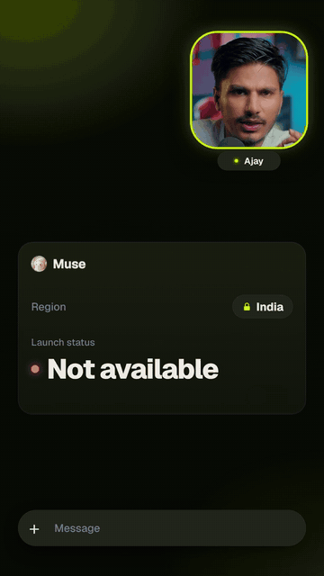 | 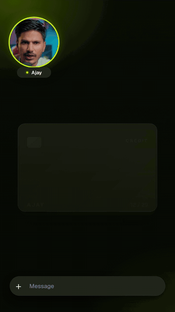 | 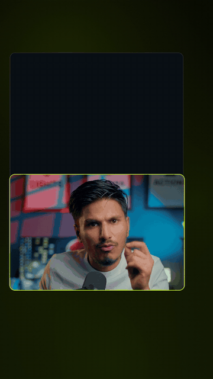 | 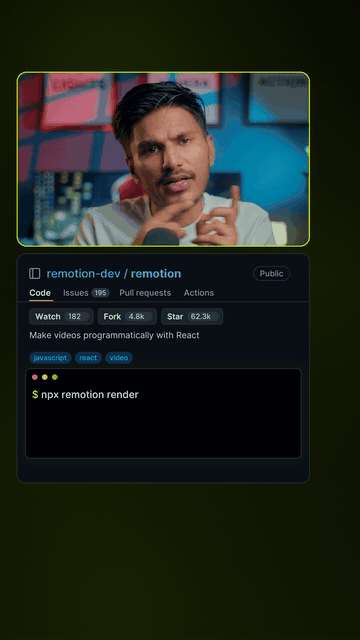 |

**Tutorial / series (DaVinci Resolve)**
| DaVinci MCP — Claude drives Resolve | DDR series — Day 1 reel | DDR — Day 2 | DDR — Day 4 |
|---|---|---|---|
| 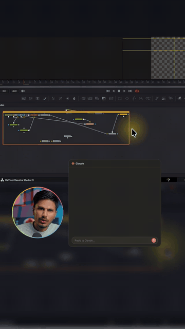 | 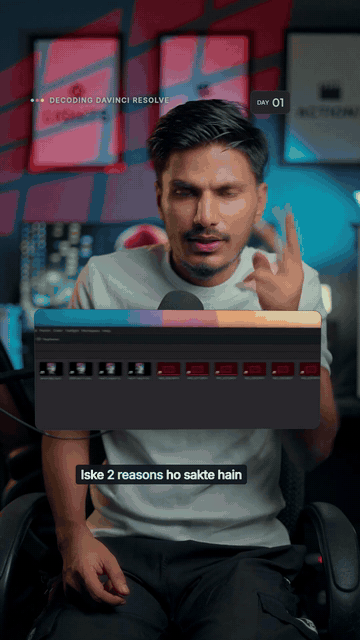 | 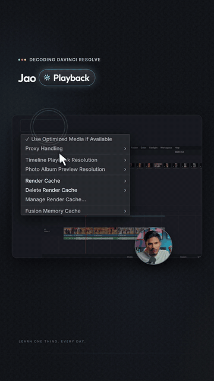 | 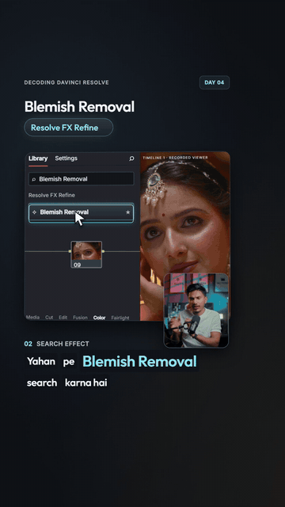 |

**SaaS product walkthroughs** (UI built from an empty shell, camera travels to every click)
| Juno — search beat | Juno — 30-day calendar | Screenlark — editor builds | Screenlark — competitors |
|---|---|---|---|
| 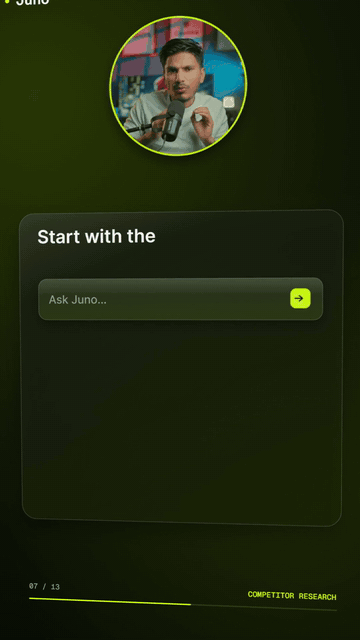 | 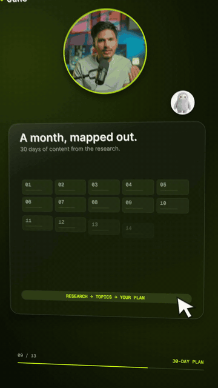 | 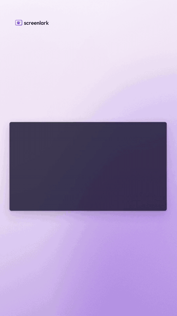 | 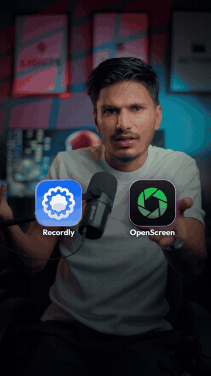 |

**Idents, ads & hooks**
| Series ident (real 3D icons) | Product ad (morph chain) | Reel hook (dense, face + real UI) |
|---|---|---|
| 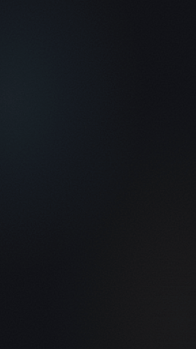 | 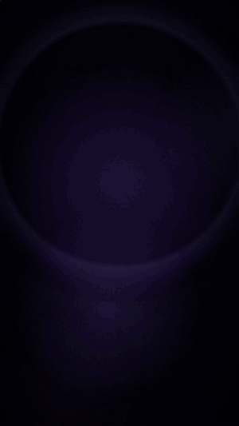 | 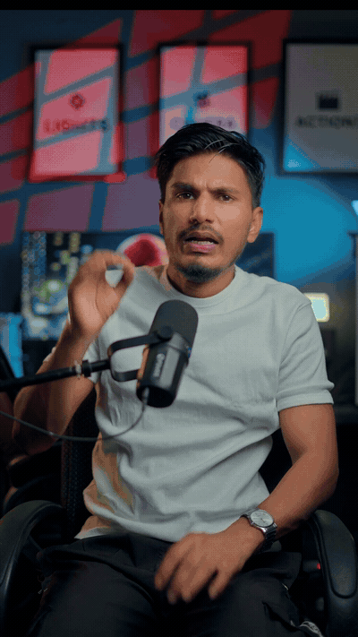 |

Goal: grow this folder, reel by reel, until it can be packaged as our own Claude skill
(final name: **glyph-motions**) — a derivative of the
`onetake` skill (`~/.claude/skills/onetake`) with the user's rules, taste and corrections baked in.

## Standing rule
EVERY animation / motion graphic / ad is built with the **onetake skill, in depth**.
While doing so, every new learning is written HERE immediately (not just in `../learnings.md`).

## Files (append-only logs + curated rules)
| File | What goes in | When to write |
|---|---|---|
| `RULES.md` | Curated, deduplicated rules (the future SKILL.md body). Each rule: statement, why, source tag. | Whenever a rule is new or sharpened |
| `CORRECTIONS.md` | Every user correction: what I did -> what user said -> rule it produced. | Right after any feedback/rejection/approval |
| `REFERENCES.md` | Videos/links/screenshots the user supplied + measured analysis (analyze_ref numbers, look, moves). | When user shares a ref or I analyze one |
| `TECHNIQUES.md` | Working onetake recipes (camera, morph, glass, face-as-jpg-seq, render flags, ...). | When something works |
| `GOTCHAS.md` | Bugs/failed attempts + fix (Windows, CSS 3D, onetake, ffmpeg...). | The moment an error happens |

## How an entry looks
`- [YYYY-MM-DD · reelN/source] text` — keep one fact per bullet. Promote stable facts into `RULES.md`.

## Packaging into a skill (later)
1. Freeze RULES.md -> SKILL.md (protocol + rules), TECHNIQUES.md + GOTCHAS.md -> references/.
2. Ship own `lib/` additions (e.g. glass panels, words(), face jpg-seq loader, camera-to-click helper) as `lib/glyph.js`.
3. Keep onetake's LICENSE (PolyForm Noncommercial 1.0.0) and author credit (Patrick / feitangyuan) — it is a derivative;
   check the license before any commercial/public distribution.
4. Test on a fresh reel; the user approves; only then publish/install to `~/.claude/skills/`.

## Credit
Derivative workflow of the `onetake` skill by Patrick (github.com/feitangyuan/onetake), PolyForm Noncommercial 1.0.0. onetake's own files (lib/motion.js, ui_kit.js, scripts, templates, references) are included unchanged with its LICENSE; everything else is ours (see NOTICE).

## Use it for your next video
`sh install.sh` (or `.\install.ps1`), then tell Claude Code: "edit this video with saas-video-editor: <file>". See `INSTALL.md` and `WORKFLOW.md`.
Tools: `scripts/new_reel.py` (project + face frames + transcript), `scripts/transcribe.py` (Hinglish-safe), `scripts/render.py` (shutter-blur render),
`scripts/make_preview.py` (playable copy / GIF), `templates/reel9x16/comp.html` (vertical starter, test render passed: 270 frames, no page errors).

## Contents now
`SKILL.md` (entry) · `lib/` (onetake motion.js + ui_kit.js + our glyph.js) · `scripts/` (render, stills, vstills, probe, analyze_ref, ...) ·
`templates/` · `references/` (onetake docs) · `examples/` (Juno, DDR, Screenlark build code, no media) · `LICENSE` + `NOTICE`.
